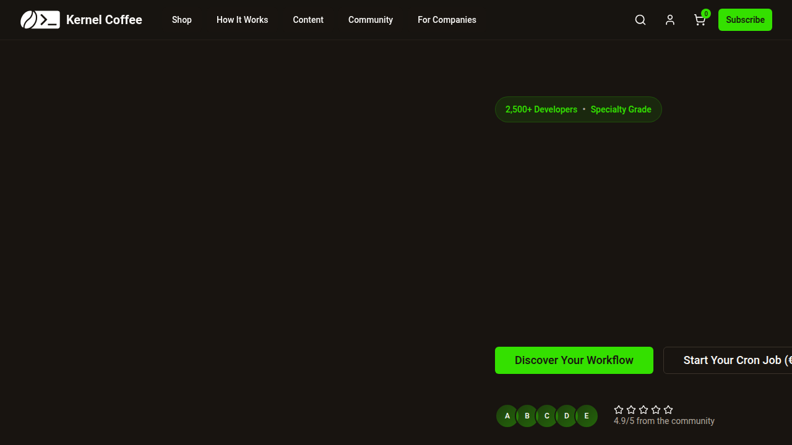
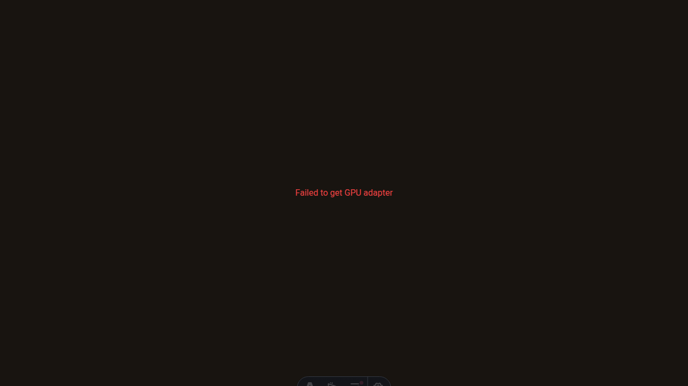
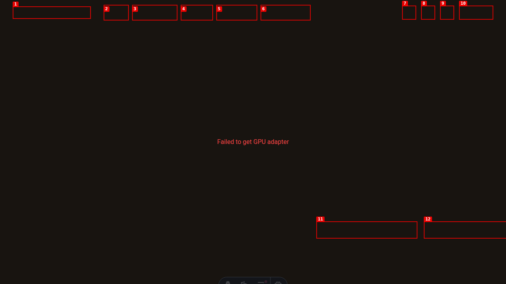

### ISSUE-003: Visual content rendering and layout inconsistencies

| Field | Value |
|-------|-------|
| **Severity** | Medium |
| **Category** | Visual |
| **URL** | http://localhost:4321/ |
| **Repro Video** | dogfood-output/videos/issue-003-visual-content.webm |

**Description**

The page shows inconsistent visual rendering with potential layout issues. Content appears to have rendering problems, possibly related to the failed WebGPU/ASCII background or other visual components not loading properly.

**Repro Steps**

1. Open Kernel Coffee homepage and observe initial state
   

2. Scroll up to examine header and hero section content
   

3. **Observe:** Inconsistent visual rendering and potential layout issues in content presentation
   

**Evidence:**
- Visual inconsistencies in content rendering across different scroll positions
- Potential layout problems affecting readability and user experience
- Correlation with WebGPU initialization failures suggesting visual component issues

**Impact:** Affects visual appeal and user experience, potentially causing confusion about content hierarchy and readability.

**Recommendation:** Investigate visual rendering issues, ensure consistent layout across all screen sizes, and address WebGPU compatibility problems that may be affecting visual components.